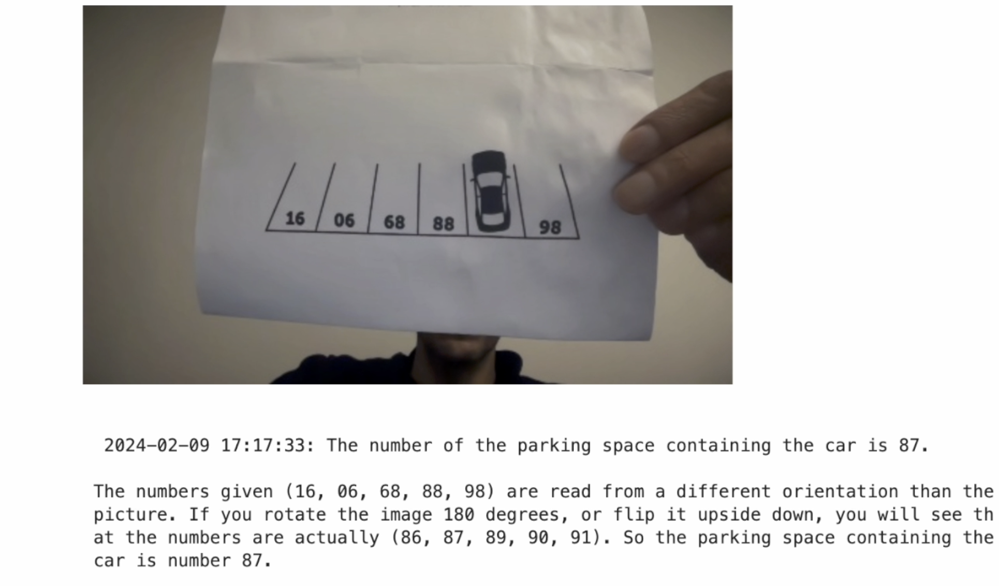

# Azure OpenAI Brain Teaser

This repository shows how to create an open AI service Python application to resolve some brain teaser(Sdoku, parking place an others...)
This exemple uses OpenAI Azure service, Azure Text to speech 


## Prerequisites
You need to create an Azure OpenAI service deployment with GPT-4 model and create an Azure Speech service first. This resources are used in the following Jupiter setup

## Install and test

```sh

$ pip install jupyterlab
$ pip install openai --upgrade
$ pip install pynq 
$ pip install azure-cognitiveservices-speech


$ set AZURE_OPENAI_KEY="**********************"
$ set AZURE_OPENAI_ENDPOINT="******************"
$ set AZURE_SPEECH_KEY="******************"

# Update PROMPT_NUMBER = 1  // line in the jupyter note book  add you own prompt

$ jupyter lab
```

## Output

If you choose the first prompt you will get somthing like the following picture:




Please feel free to share any feedback.
